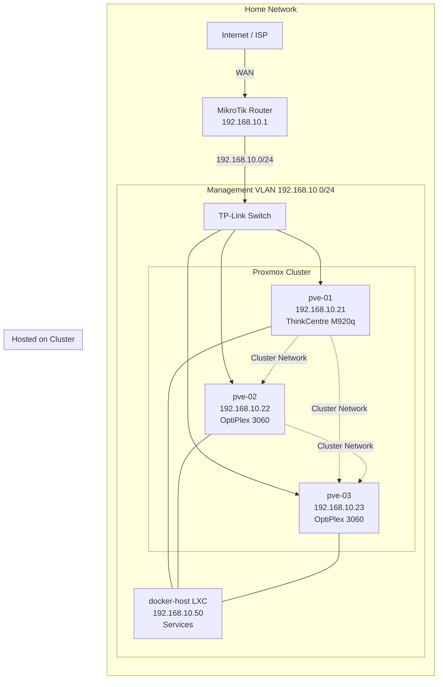

# Homelab Workshop

> Transform your home into a powerful learning lab. Build production-like infrastructure from the ground up with hands-on Proxmox, Terraform, and Docker.

## Welcome to the Homelab Workshop

This comprehensive workshop guides you through designing, building, and managing a modern homelab infrastructure. Whether you're a curious developer wanting to level up your infrastructure skills or an operations enthusiast looking to build a personal cloud environment, this workshop will equip you with practical knowledge and real-world experience.

In this workshop, you'll progress from foundational concepts to deploying production-grade services on your own hardware. You'll work with enterprise-grade technologies like Proxmox hypervisor, Infrastructure as Code with Terraform, and containerized applications with Docker—all within a home environment.

### What You'll Learn

**Foundational Knowledge**
- Understanding homelabs and their value in professional development
- Network design and planning for home infrastructure
- Hardware selection and deployment strategies
- Virtualization fundamentals with Proxmox

**Hands-On Skills**
- Infrastructure as Code practices using Terraform
- Virtual machine and container deployment automation
- VPN/tunnel configuration with Tailscale
- Multi-service orchestration with Docker Compose
- Running real-world applications (DNS, reverse proxy, media servers, storage, collaboration tools)

**Professional Practices**
- Infrastructure documentation and version control
- Monitoring and troubleshooting
- Scalability and resilience planning
- Cost optimization

## Prerequisites

Before attending this workshop, please ensure you have:

### Hardware Requirements
- **Laptop/Desktop**: Any modern computer with 8GB+ RAM for SSH and management tasks
- **Homelab Hardware**: A 3-node Proxmox cluster (provided reference configuration below)

### Software & Knowledge
- **Linux Basics**: Comfort with command line, basic file system navigation
- **Text Editor**: VS Code, Vim, or your preferred editor
- **SSH Client**: Built-in on macOS/Linux; PuTTY or Windows Terminal for Windows
- **Git**: Version control fundamentals (we'll help with specifics)
- **Docker Familiarity**: Basic understanding helpful but not required

### Network Setup
- Local network access to all Proxmox nodes
- Internet connectivity for package installation
- Ability to manage router settings (or permission from network admin)

## Workshop Schedule

**Total Duration:** 2.5 hours (150 minutes)

### Session 1: Theory & Foundation (~55 min)

Master the fundamentals before building.

| Time | Topic | Duration |
|------|-------|----------|
| 0:00 | **What is Homelab?** Why build one, use cases, getting started | 10 min |
| 0:10 | **Hardware Selection** Mini PCs, specs, budget, power analysis | 10 min |
| 0:20 | **Network & Infrastructure Design** VLANs, IP scheme, security | 15 min |
| 0:35 | **Proxmox Overview & Setup** Installation, clustering, LXC vs VMs | 15 min |
| 0:50 | **Q&A** | 5 min |

**Session 1 Materials**: [Theory Slides](./slides/session-1-theory.md) | [Documentation](./docs/session-1/)

### Break (10 min)

### Session 2: Hands-On Implementation (~75 min)

Build, deploy, and automate your infrastructure.

| Time | Topic | Duration |
|------|-------|----------|
| 0:00 | **Terraform + Proxmox** IaC intro, provider setup, API tokens | 15 min |
| 0:15 | **Deploy LXC Container** Write module, deploy docker-host, verify | 15 min |
| 0:30 | **Tailscale VPN** Install, connect, subnet routing | 10 min |
| 0:40 | **Docker Compose Services** AdGuard DNS, Cloudflare Tunnel, and more | 25 min |
| 1:05 | **Additional Services & Wrap-up** Immich, Nextcloud, Plex, next steps | 5 min |
| 1:10 | **Q&A** | 5 min |

**Session 2 Materials**: [Hands-On Slides](./slides/session-2-hands-on.md) | [Documentation](./docs/session-2/)

## Repository Structure

```
homelab-workshop/
│
├── README.md                          # You are here
├── LICENSE
│
├── slides/
│   ├── session-1-theory.md           # Theory session presentation
│   └── session-2-hands-on.md         # Hands-on session presentation
│
├── docs/
│   ├── session-1/                    # Theory session deep-dives
│   │   ├── 01-what-is-homelab.md           # Homelab philosophy and benefits
│   │   ├── 02-getting-started.md           # First steps in homelabbing
│   │   ├── 03-hardware-selection.md        # Choosing and buying hardware
│   │   ├── 04-network-infrastructure.md    # Network design and planning
│   │   └── 05-proxmox-setup.md             # Proxmox installation and config
│   │
│   └── session-2/                    # Hands-on session guides
│       ├── 01-terraform-proxmox.md         # Terraform provider setup
│       ├── 02-deploy-lxc-vm.md            # Deploying resources
│       ├── 03-tailscale-setup.md          # VPN and remote access
│       ├── 04-docker-compose-services.md  # Application deployment
│       └── 05-additional-services.md      # Advanced applications
│
├── configs/
│   ├── terraform/
│   │   ├── main.tf                   # Primary Terraform configuration
│   │   ├── variables.tf              # Input variables
│   │   ├── outputs.tf                # Output values
│   │   ├── proxmox.tf                # Proxmox-specific resources
│   │   └── examples/                 # Example deployments
│   │
│   └── docker-compose/
│       ├── adguard/
│       ├── cloudflare-tunnel/
│       ├── immich/
│       ├── nextcloud/
│       ├── plex/
│       └── docker-compose.yml        # Master compose file
│
└── architecture/
    └── hardware.json                 # Reference hardware configuration
```

## Quick Start

### 1. Clone This Repository

```bash
git clone <repository-url>
cd homelab-workshop
```

### 2. Review the Architecture

Check out the reference hardware configuration and network design:

```bash
cat architecture/hardware.json
```

### 3. Start with Session 1

Begin with theory to understand the concepts:

```bash
# Read the overview
cat docs/session-1/01-what-is-homelab.md

# Continue with foundational knowledge
cat docs/session-1/02-getting-started.md
```

### 4. Prepare Your Homelab

Follow the guides to set up your Proxmox cluster:

```bash
# Hardware selection guide
cat docs/session-1/03-hardware-selection.md

# Network planning
cat docs/session-1/04-network-infrastructure.md

# Proxmox setup
cat docs/session-1/05-proxmox-setup.md
```

### 5. Deploy with Terraform

Once your Proxmox is ready, automate deployments:

```bash
cd configs/terraform
terraform init
terraform plan
terraform apply
```

### 6. Add Applications

Deploy services using Docker Compose:

```bash
cd configs/docker-compose
docker-compose up -d
```

## Reference Hardware & Network

### Cluster Configuration

This workshop uses a 3-node Proxmox cluster for redundancy and load distribution:

| Node | Hardware | Role | IP Address |
|------|----------|------|-----------|
| **pve-01** | Lenovo ThinkCentre M920q | Primary | 192.168.10.21 |
| **pve-02** | Dell OptiPlex 3060 Micro | Secondary | 192.168.10.22 |
| **pve-03** | Dell OptiPlex 3060 Micro | Tertiary | 192.168.10.23 |
| **docker-host** | LXC Container on Cluster | Services | 192.168.10.50 |

### Network Architecture



### Network Details

- **Network Range**: 192.168.10.0/24
- **Gateway/Router**: 192.168.10.1 (MikroTik)
- **DHCP Range**: 192.168.10.100-200
- **Static Reservations**:
  - 192.168.10.21 → pve-01
  - 192.168.10.22 → pve-02
  - 192.168.10.23 → pve-03
  - 192.168.10.50 → docker-host (Docker/services LXC container)

### Hardware Benefits

**Lenovo ThinkCentre M920q (pve-01)**
- Compact form factor (17L)
- Reliable enterprise-grade components
- Sufficient for production homelab workloads
- Low power consumption (15-25W idle)

**Dell OptiPlex 3060 Micro (pve-02, pve-03)**
- Excellent cost-to-performance ratio
- Small footprint suitable for shelving
- Quiet operation (excellent for living spaces)
- Adequate RAM and storage options

**Network Infrastructure**
- TP-Link Switch: Simple managed switching with VLAN support
- MikroTik Router: Advanced routing and firewalling capabilities
- All nodes connected via Gigabit Ethernet

## Session Documentation

### Session 1: Theory & Foundations

Build your knowledge foundation with these detailed guides:

1. **[What is Homelab?](./docs/session-1/01-what-is-homelab.md)**
   - Definition and philosophy
   - Why homelabs matter for tech professionals
   - Real-world applications and career benefits

2. **[Getting Started](./docs/session-1/02-getting-started.md)**
   - Common homelab patterns
   - Beginner-friendly first projects
   - Avoiding common pitfalls

3. **[Hardware Selection](./docs/session-1/03-hardware-selection.md)**
   - Choosing processors (CPU requirements)
   - RAM recommendations for different workloads
   - Storage options (local, NAS, cloud)
   - Power consumption and cooling considerations
   - Budget optimization strategies

4. **[Network & Infrastructure Design](./docs/session-1/04-network-infrastructure.md)**
   - Network topology planning
   - VLAN segmentation
   - DNS and DHCP setup
   - Security considerations
   - Capacity planning

5. **[Proxmox Setup](./docs/session-1/05-proxmox-setup.md)**
   - Installation from ISO
   - Initial configuration
   - Cluster formation
   - Storage backend selection
   - High availability setup

### Session 2: Hands-On Implementation

Put theory into practice with automated deployments:

1. **[Terraform + Proxmox](./docs/session-2/01-terraform-proxmox.md)**
   - Terraform provider installation
   - Authentication and API tokens
   - Writing your first resource
   - Organizing code structure
   - Variables and outputs

2. **[Deploy VMs & LXC Containers](./docs/session-2/02-deploy-lxc-vm.md)**
   - Container vs VM decision making
   - Using Terraform to provision LXC containers
   - Deploying full virtual machines
   - Post-deployment configuration
   - Troubleshooting deployments

3. **[Tailscale VPN Setup](./docs/session-2/03-tailscale-setup.md)**
   - Why use Tailscale in a homelab
   - Installation and authentication
   - Client setup (Linux, Mac, Windows, iOS, Android)
   - Accessing homelab services remotely
   - Security best practices

4. **[Docker Compose Services](./docs/session-2/04-docker-compose-services.md)**
   - Docker and Docker Compose fundamentals
   - AdGuard Home for DNS-level blocking
   - Cloudflare Tunnel for secure public access
   - Service networking and volumes
   - Backup and persistence strategies

5. **[Additional Services](./docs/session-2/05-additional-services.md)**
   - Immich for photo management
   - Nextcloud for personal cloud storage
   - Plex Media Server for streaming
   - Other useful services and configurations
   - Monitoring and alerting setup

## Resources & References

### Essential Links

**Proxmox**
- [Official Proxmox Documentation](https://pve.proxmox.com/pve-docs/)
- [Proxmox API Reference](https://pve.proxmox.com/pve-docs/api-viewer/)
- [Community Forums](https://forum.proxmox.com/)

**Terraform**
- [Terraform Official Docs](https://www.terraform.io/docs)
- [Proxmox Terraform Provider](https://registry.terraform.io/providers/Telmate/proxmox/latest/docs)
- [Terraform Best Practices](https://www.terraform.io/docs/cloud/guides/recommended-practices)

**Docker & Containers**
- [Docker Official Documentation](https://docs.docker.com/)
- [Docker Compose Reference](https://docs.docker.com/compose/compose-file/)
- [Docker Hub](https://hub.docker.com/)

**Networking & Security**
- [Tailscale Documentation](https://tailscale.com/kb/)
- [VPN Concepts](https://en.wikipedia.org/wiki/Virtual_private_network)
- [Network Security Basics](https://www.cloudflare.com/learning/)

### Recommended Learning

**Books**
- "Infrastructure as Code" by Kief Morris
- "The Phoenix Project" by Gene Kim et al.
- "Linux Administration Handbook" by Evi Nemeth et al.

**Online Resources**
- Linux Academy courses
- KodeKloud tutorials
- YouTube channels: NetworkChuck, TechWorld with Nana, Linus Tech Tips

### Community

- Proxmox Forum: Active community for Proxmox questions
- Reddit: r/homelab, r/terraform, r/docker
- Discord: Various homelab and container communities
- Local meetups: Check for infrastructure and DevOps meetups in your area

## Getting Help

### Troubleshooting Guide

If you encounter issues:

1. **Check the documentation** - Most common issues are covered in Session 1-2 docs
2. **Review error messages** - Terraform and Docker provide helpful error output
3. **Check logs** - Proxmox/container logs often reveal the root cause
4. **Search online** - Your specific error message likely has solutions in forums
5. **Ask in communities** - Reddit's r/homelab and Proxmox forums are welcoming

### Common Issues

- **SSH Connection Failed**: Verify firewall rules and network connectivity
- **Terraform Apply Fails**: Check API token permissions and Proxmox connectivity
- **Docker Service Won't Start**: Review compose file syntax and resource availability
- **Container Network Issues**: Verify VLAN and bridge configuration

## Contributing

Have improvements to the workshop? Contributions are welcome!

1. Fork the repository
2. Create a feature branch (`git checkout -b feature/improvement`)
3. Make your changes
4. Submit a pull request with a clear description

## License

This workshop content is provided as-is for educational purposes.

---

## Next Steps

Ready to start? Here's your path forward:

1. **Today**: Read through [What is Homelab?](./docs/session-1/01-what-is-homelab.md)
2. **This Week**: Plan your hardware using [Hardware Selection](./docs/session-1/03-hardware-selection.md)
3. **Next Week**: Design your network with [Network Infrastructure](./docs/session-1/04-network-infrastructure.md)
4. **Then**: Follow [Proxmox Setup](./docs/session-1/05-proxmox-setup.md) to build your cluster
5. **Finally**: Deploy automatically with Sessions 2 guides

**Good luck, and welcome to your homelab journey!**

---

*Last Updated: February 2026*
