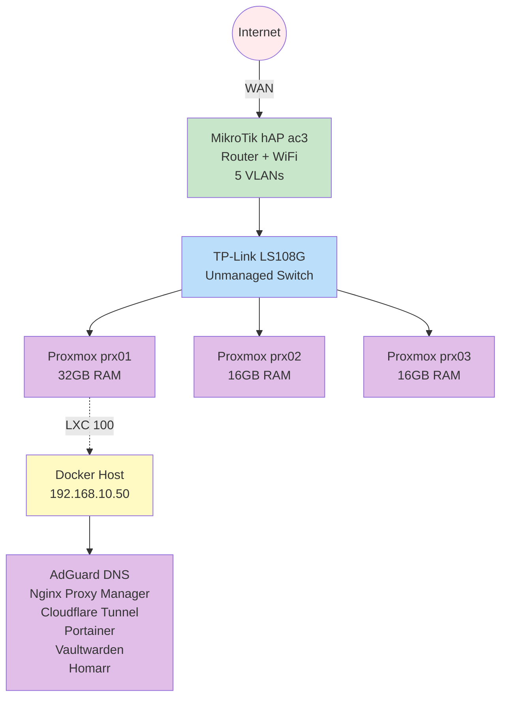
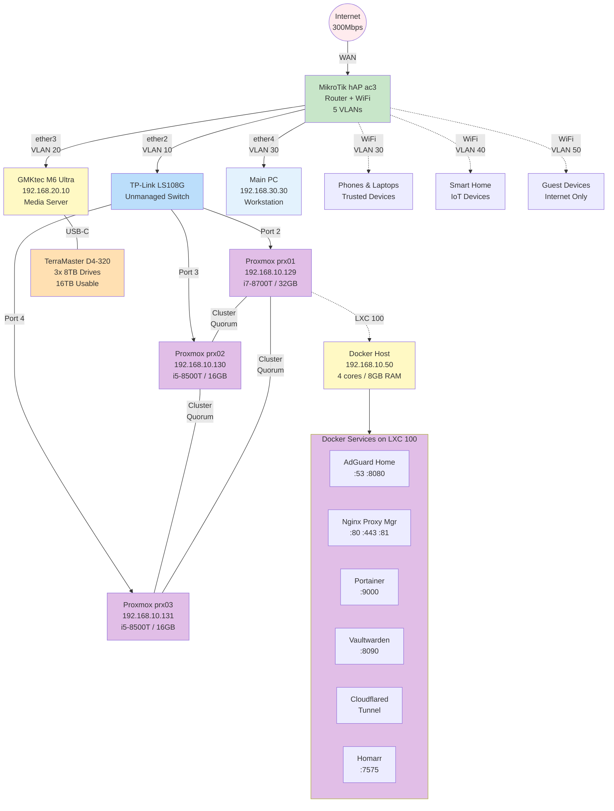

# Network Architecture Diagrams

## Simple Overview

```mermaid
graph TB
    Internet((Internet))

    Internet -->|WAN| hAP[MikroTik hAP ac3<br/>Router + WiFi<br/>5 VLANs]

    hAP --> Switch[TP-Link LS108G<br/>Unmanaged Switch]

    Switch --> PRX01[Proxmox prx01<br/>32GB RAM]
    Switch --> PRX02[Proxmox prx02<br/>16GB RAM]
    Switch --> PRX03[Proxmox prx03<br/>16GB RAM]

    PRX01 -.->|LXC 100| DockerHost[Docker Host<br/>192.168.10.50]

    DockerHost --> Services[AdGuard DNS<br/>Nginx Proxy Manager<br/>Cloudflare Tunnel<br/>Portainer<br/>Vaultwarden<br/>Homarr]

    style Internet fill:#ffebee
    style hAP fill:#c8e6c9
    style Switch fill:#bbdefb
    style PRX01 fill:#e1bee7
    style PRX02 fill:#e1bee7
    style PRX03 fill:#e1bee7
    style DockerHost fill:#fff9c4
    style Services fill:#e1bee7
```

---

## Full Architecture with VLANs

```mermaid
graph TB
    Internet((Internet<br/>300Mbps))

    Internet -->|WAN| hAP[MikroTik hAP ac3<br/>Router + WiFi<br/>5 VLANs]

    hAP -->|ether2<br/>VLAN 10| Switch[TP-Link LS108G<br/>Unmanaged Switch]

    Switch -->|Port 2| PRX01[Proxmox prx01<br/>192.168.10.129<br/>i7-8700T / 32GB]
    Switch -->|Port 3| PRX02[Proxmox prx02<br/>192.168.10.130<br/>i5-8500T / 16GB]
    Switch -->|Port 4| PRX03[Proxmox prx03<br/>192.168.10.131<br/>i5-8500T / 16GB]

    PRX01 ---|Cluster<br/>Quorum| PRX02
    PRX02 ---|Cluster<br/>Quorum| PRX03
    PRX03 ---|Cluster<br/>Quorum| PRX01

    PRX01 -.->|LXC 100| DockerHost[Docker Host<br/>192.168.10.50<br/>4 cores / 8GB RAM]

    subgraph Services[Docker Services on LXC 100]
        direction LR
        AdGuard[AdGuard Home<br/>:53 :8080]
        NPM[Nginx Proxy Mgr<br/>:80 :443 :81]
        Portainer[Portainer<br/>:9000]
        Vault[Vaultwarden<br/>:8090]
        CF[Cloudflared<br/>Tunnel]
        Homarr[Homarr<br/>:7575]
    end

    DockerHost --> Services

    hAP -->|ether3<br/>VLAN 20| GMKtec[GMKtec M6 Ultra<br/>192.168.20.10<br/>Media Server]

    hAP -->|ether4<br/>VLAN 30| PC[Main PC<br/>192.168.30.30<br/>Workstation]

    hAP -.->|WiFi<br/>VLAN 30| Trusted[Phones & Laptops<br/>Trusted Devices]
    hAP -.->|WiFi<br/>VLAN 40| IoT[Smart Home<br/>IoT Devices]
    hAP -.->|WiFi<br/>VLAN 50| Guest[Guest Devices<br/>Internet Only]

    GMKtec ---|USB-C| DAS[TerraMaster D4-320<br/>3x 8TB Drives<br/>16TB Usable]

    style Internet fill:#ffebee
    style hAP fill:#c8e6c9
    style Switch fill:#bbdefb
    style GMKtec fill:#fff9c4
    style DAS fill:#ffe0b2
    style PRX01 fill:#e1bee7
    style PRX02 fill:#e1bee7
    style PRX03 fill:#e1bee7
    style DockerHost fill:#fff9c4
    style Services fill:#e1bee7
    style PC fill:#e3f2fd
```
