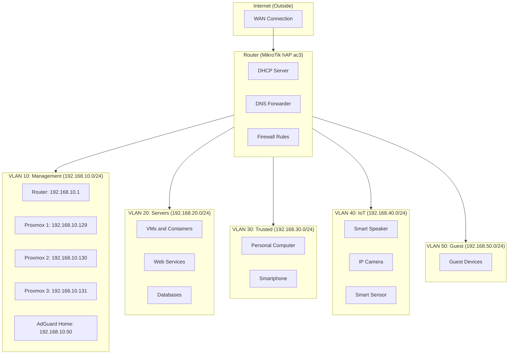
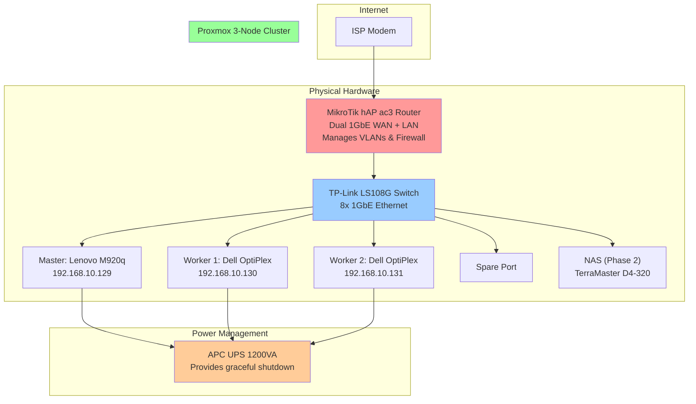

# Network Infrastructure and Design

## Network Fundamentals for Homelabs

Before designing a homelab network, we need to understand the foundational concepts.

### IP Addressing

**What is an IP Address?**
An IP address is a unique identifier for devices on a network, much like a postal address for houses.

```
Example: 192.168.10.50
         └─┬─┘ └─┬─┘ └──┬──┘ └─┬─┘
           |     |      |      |
         First   |      |    Host part
         octet   |      |  (device specific)
                 |    Network portion
              Second  identifies "building"
              octet
```

**IPv4 Basics:**
- 32-bit addresses: 0.0.0.0 to 255.255.255.255
- Written as 4 octets (0-255 each)
- Unique per device on same network
- Can be static (doesn't change) or dynamic (DHCP assigned)

### Subnetting and CIDR Notation

**Subnet Mask:** Determines how many addresses are available

```
/24 subnet (most common for homelabs):
  Network: 192.168.10.0/24
  Usable IPs: 192.168.10.1 - 192.168.10.254 (254 addresses)
  Broadcast: 192.168.10.255

  Why /24?
  - /24 means "first 24 bits define network, last 8 bits for hosts"
  - 2^8 = 256 addresses total (254 usable)
  - Perfect for homelabs up to 250 devices
```

**Common subnet sizes:**
- /24 (255.255.255.0): 254 usable hosts - **Use this for homelabs**
- /25 (255.255.255.128): 126 usable hosts
- /22 (255.255.252.0): 1022 usable hosts - Use if you need many devices
- /32 (255.255.255.255): Single host - Use for specific routes

### DHCP and Static IPs

**DHCP (Dynamic Host Configuration Protocol):**
- Automatically assigns IP addresses to devices
- Devices get different IPs if they reconnect
- Convenient for end devices (laptops, phones)
- **Not suitable** for servers and cluster nodes

**Static IPs:**
- Admin manually assigns address
- Address never changes
- Required for servers, cluster nodes, infrastructure
- Ensures reliable access

**Homelab rule of thumb:**
- **DHCP:** Users' laptops, phones, guests
- **Static:** Infrastructure (servers, network equipment, printers)

### VLANs (Virtual LANs)

**What is a VLAN?**
A VLAN is a logical network segment within a physical network. Think of it as creating multiple separate networks on a single switch.

**Why VLANs Matter:**
- **Security:** IoT devices isolated from servers
- **Privacy:** Guest network can't access your files
- **Organization:** Different purposes on different VLANs
- **Control:** Different firewall rules per VLAN
- **Flexibility:** Devices move networks without recabling

**Simple analogy:**
Imagine your switch is a mailroom with 8 slots. With VLANs, you can say:
- Slots 1-2: Management network
- Slots 3-4: Server network
- Slots 5-6: IoT network
- Slot 7: Guest network
- Slot 8: Uplink

Physical cables don't change, but logically they're separate networks.

### Firewalling and Access Control

**Firewall Function:**
Determines which devices can communicate with which other devices.

**Types of rules:**
- **Allow:** Permit specific traffic
- **Deny:** Block specific traffic
- **Log:** Record traffic for analysis

**Typical homelab rules:**
- Management network: Full access to everything
- Server network: Can access storage and internet
- IoT network: Can access internet but not home servers
- Guest network: Internet only, cannot access internal networks

## Why VLANs Matter for Your Homelab

### Security Segmentation

Without VLANs (flat network):
```
Internet
   |
Router
   |
   +--- Smart speaker
   +--- Web server
   +--- Database
   +--- Guest laptop
   +--- IP camera

Problem: Compromised camera can access database directly
```

With VLANs (segmented network):
```
Internet
   |
Router (firewall)
   |
   +--- VLAN 10 (Management): Router, Proxmox
   +--- VLAN 20 (Servers): Web server, Database
   +--- VLAN 30 (Trusted): Personal devices
   +--- VLAN 40 (IoT): Smart speakers, cameras
   +--- VLAN 50 (Guest): Visitor devices

Firewall enforces:
- IoT devices cannot reach database
- Guests cannot access anything else
- Servers can reach storage and internet
- Management isolated for security
```

### Real-World Example: Camera Compromise

**Scenario:** Someone compromises your IP camera firmware

**Without VLAN:**
- Camera gains access to your entire network
- Can scan for other devices
- Could access file shares, databases
- Could launch attacks on servers

**With VLAN:**
- Camera is on IoT VLAN
- Firewall blocks access to other VLANs
- Camera can only reach internet
- Other services completely protected

## Our 5-VLAN Design

This homelab uses 5 distinct VLANs for different purposes.

### VLAN Design Diagram



### VLAN Assignments and Purpose

| VLAN ID | Name | Subnet | Gateway | Purpose | Key Devices |
|---------|------|--------|---------|---------|------------|
| 10 | Management | 192.168.10.0/24 | 192.168.10.1 | Infrastructure management | Router, Proxmox nodes, AdGuard Home |
| 20 | Servers | 192.168.20.0/24 | 192.168.20.1 | Application services | VMs, containers, databases, web services |
| 30 | Trusted | 192.168.30.0/24 | 192.168.30.1 | Personal devices | Your PC, phone, laptop |
| 40 | IoT | 192.168.40.0/24 | 192.168.40.1 | Internet-of-Things | Smart speakers, cameras, sensors |
| 50 | Guest | 192.168.50.0/24 | 192.168.50.1 | Guest network | Visitor devices, temporary access |

### VLAN Details and Access Rules

**VLAN 10 - Management:**
- Contains: Router, Proxmox cluster, AdGuard Home
- Access: Only you, admin role
- External access: VPN only
- Firewall rules: Full access to all VLANs (management needs this)
- Critical: VLAN 10 compromise = total infrastructure compromise
- Protection: Strong authentication, no password weaker than 20 characters

**VLAN 20 - Servers:**
- Contains: Running services, databases, web applications
- Access: Accessed by trusted devices, restricted from IoT/guest
- External access: Through reverse proxy only
- Firewall rules:
  - Outbound: Internet, storage access
  - Inbound from VLAN 30 (Trusted): Allowed
  - Inbound from VLAN 40 (IoT): Limited (only specific services if needed)
  - Inbound from VLAN 50 (Guest): Blocked
- Benefit: Services protected from compromised IoT device

**VLAN 30 - Trusted:**
- Contains: Your personal devices
- Access: Full access to servers and management (with password auth)
- External access: Whatever you allow
- Firewall rules:
  - Outbound: Unrestricted
  - Inbound: From management for admin functions
- Assumption: You trust these devices completely

**VLAN 40 - IoT:**
- Contains: Smart home devices (speakers, cameras, sensors)
- Access: Internet access, selected services with explicit permission
- External access: Limited/none (manufacturers' services only)
- Firewall rules:
  - Outbound: Internet only
  - Inbound: Blocked
  - Exception: Explicit allow for specific services (Home Assistant remote access, etc.)
- Rationale: IoT devices are often insecure, compartmentalize them

**VLAN 50 - Guest:**
- Contains: Visitor devices, temporary devices
- Access: Internet access only
- External access: None to your infrastructure
- Firewall rules:
  - Outbound: Internet only
  - Inbound: Blocked entirely
  - Cannot see or access any internal service
- Assumption: Guest devices are untrusted

## Physical Network Topology Diagram



### Physical Connection Details

**Router to Modem:**
- ISP modem connects to Router WAN port (ISP ethernet)
- Router LAN port connects to Switch
- Both typically 1GbE speed (typical for home internet)

**Switch to Cluster:**
- 3 Proxmox nodes: Each has 1x 1GbE connection
- Each port on TP-Link switch is independent
- All ports on same VLAN initially
- Later: Upgrade to managed switch for VLAN tagging

**Cabling:**
- Cat6 or better cables (future-proof)
- All same length preferred (easier troubleshooting)
- Label both ends (Port 1, M-1, etc.)
- Organized with cable ties
- Away from AC power cables (reduces interference)

## IP Addressing Scheme and Static Reservations

### Management VLAN (VLAN 10) IP Allocation

```
VLAN 10: 192.168.10.0/24

Network address:  192.168.10.0
Usable range:     192.168.10.1 - 192.168.10.254
Broadcast:        192.168.10.255

Allocation:
  192.168.10.1      - Router (gateway)
  192.168.10.2-49   - Reserved for future infrastructure
  192.168.10.50     - AdGuard Home (DNS server)
  192.168.10.51-128 - Reserved for future services

  CLUSTER NODES (Static IP Reservations):
  192.168.10.129    - Proxmox Master (M920q)
  192.168.10.130    - Proxmox Worker 1 (OptiPlex)
  192.168.10.131    - Proxmox Worker 2 (OptiPlex)

  192.168.10.132-254 - Unallocated (reserved)
```

### Other VLANs IP Allocation

```
VLAN 20 (Servers): 192.168.20.0/24
  192.168.20.1      - Gateway
  192.168.20.50+    - Service IPs (via Docker/VM networks)

VLAN 30 (Trusted): 192.168.30.0/24
  192.168.30.1      - Gateway
  192.168.30.100+   - DHCP pool for trusted devices

VLAN 40 (IoT): 192.168.40.0/24
  192.168.40.1      - Gateway
  192.168.40.100+   - DHCP pool for IoT devices

VLAN 50 (Guest): 192.168.50.0/24
  192.168.50.1      - Gateway
  192.168.50.100+   - DHCP pool for guest devices
```

### Naming and Access

**For Management VLAN (VLAN 10):**
- Access proxmox01.local via hostname (use mDNS/Avahi)
- SSH: `ssh root@192.168.10.129`
- Web UI: `https://192.168.10.129:8006`

**For Services:**
- Use reverse proxy (nginx, Traefik) to access services
- Internal service names: `adguard.local`, `nextcloud.local`, etc.
- External (from guest/IoT): blocked unless explicitly exposed

## DNS Architecture

### Why Custom DNS?

Instead of using your ISP's DNS:
1. **Privacy:** ISP can see every website you visit
2. **Ad blocking:** Block ads at DNS level across entire network
3. **Control:** Add custom records for internal services
4. **Reliability:** Doesn't depend on ISP

### DNS Architecture Design

```mermaid
graph TB
    subgraph Internet["Internet DNS"]
        GOOGLE["8.8.8.8 (Google)"]
        CLOUDFLARE["1.1.1.1 (Cloudflare)"]
    end

    subgraph LocalDNS["Local DNS Setup"]
        AG["AdGuard Home<br/>192.168.10.50"]
        LCL["Local Zone:<br/>*.homelab.local → 192.168.10.x"]
    end

    subgraph Devices["All Network Devices"]
        D1["PC/Phone/etc"]
        D2["VM/Container"]
        D3["IoT Device"]
    end

    D1 -->|Query:google.com| AG
    D2 -->|Query:nextcloud.local| AG
    D3 -->|Query:ads.doubleclick.net| AG

    AG -->|Cached/Blocked| D1
    AG -->|Resolved to .local| D2
    AG -->|Blocked (ad domain)| D3

    AG -->|Upstream Query| GOOGLE
    AG -->|Upstream Query| CLOUDFLARE

    style AG fill:#99ff99
    style LCL fill:#99ff99
```

### DNS Query Flow

**Query 1: Google search (User PC)**
```
PC: "What's the IP of google.com?"
→ AdGuard Home receives query
→ Not in ad blocklist, checks cache
→ Not cached, asks upstream (8.8.8.8)
→ Google responds with IP
→ AdGuard caches response (1 hour)
→ Sends IP back to PC
Result: Google loads normally
```

**Query 2: Local service (Container)**
```
Container: "What's the IP of nextcloud.local?"
→ AdGuard Home receives query
→ Finds local zone record: nextcloud.local → 192.168.20.100
→ Returns IP immediately (no upstream query)
Result: Container can access Nextcloud by hostname
```

**Query 3: Ad domain (Smart speaker)**
```
Speaker: "What's the IP of ads.doubleclick.net?"
→ AdGuard Home receives query
→ Checks blocklists
→ Found! Domain is known ad tracker
→ Returns 0.0.0.0 (blocks the domain)
Result: Ad domain unreachable, ad not loaded
```

### Local Zone Configuration (Future)

In Session 2, we'll configure:
```
homelab.local. 3600 IN A 192.168.10.1
adguard.local. 3600 IN A 192.168.10.50
nextcloud.local. 3600 IN A 192.168.20.100
plex.local. 3600 IN A 192.168.20.101
...etc
```

This allows accessing services by friendly names instead of IP addresses.

## Firewall Rules Overview

### Firewall Rule Philosophy

**Principle:** Default deny, explicit allow
- Block all traffic by default
- Only allow specific necessary flows
- More restrictive is more secure

### Core Firewall Rules

**Between Management (VLAN 10) and other VLANs:**
```
Rule 1: Allow VLAN 10 → all other VLANs (management needs this)
Rule 2: Allow all other VLANs → VLAN 10:6443 (K8s API, Proxmox API)
```

**Between Trusted (VLAN 30) and Servers (VLAN 20):**
```
Rule 3: Allow VLAN 30 → VLAN 20:443 (HTTPS services)
Rule 4: Allow VLAN 30 → VLAN 20:80 (HTTP services)
```

**Between IoT (VLAN 40) and other VLANs:**
```
Rule 5: Allow VLAN 40 → Internet (WAN)
Rule 6: Block VLAN 40 → VLAN 10 (no management access)
Rule 7: Block VLAN 40 → VLAN 20 (no server access)
Rule 8: Block VLAN 40 → VLAN 30 (no trusted device access)
Exception: Allow VLAN 40 → VLAN 20:8123 (Home Assistant specific)
```

**Between Guest (VLAN 50) and other VLANs:**
```
Rule 9: Allow VLAN 50 → Internet (WAN)
Rule 10: Block VLAN 50 → VLAN 10 (no management access)
Rule 11: Block VLAN 50 → VLAN 20 (no server access)
Rule 12: Block VLAN 50 → VLAN 30 (no trusted device access)
Rule 13: Block VLAN 50 → VLAN 40 (no IoT access)
```

**Internet access:**
```
Rule 14: Allow all VLANs → Internet (WAN)
Rule 15: Allow Internet → VLAN 20:443, 80 (web services)
Rule 16: Block Internet → all other VLANs (no inbound)
Exception: Allow Internet → VPN interface (for remote access)
```

### Rule Priority Order

Firewall rules are evaluated top-to-bottom:
1. Most specific rules first
2. General rules last
3. First matching rule wins
4. Log rule hits for troubleshooting

We'll configure these in Session 2 workshop.

## Router Selection: MikroTik vs Alternatives

### Why MikroTik hAP ac3?

**Our choice specifications:**
- Dual 1GbE Ethernet (WAN and LAN)
- WiFi 5 (802.11ac) dual-band
- Advanced firewall and routing
- VLAN support
- Cost: $60-100 used

**Pros of MikroTik:**
- Professional-grade features at residential price
- Excellent firewall capabilities
- VLAN support out of box
- Web UI + command line options
- Very customizable
- Large user community

**Cons of MikroTik:**
- Learning curve (more complex than consumer routers)
- RouterOS not intuitive if you're from consumer networking
- Less glossy UI than consumer options

### Alternatives to MikroTik

**Budget Option: TP-Link Archer or Netgear Nighthawk**
- Price: $50-150
- Pros: Simple setup, consumer-friendly
- Cons: Limited VLAN support, weaker firewall
- Best for: Beginners wanting simplicity

**High-End Option: Ubiquiti UniFi Dream Machine**
- Price: $400-600
- Pros: Professional UI, excellent management, scaling
- Cons: Overkill for homelab, expensive, vendor-specific
- Best for: Multi-site networking, professional deployments

**Pure Open Source: OpenWrt on Consumer Router**
- Price: $50-150 (router) + your time
- Pros: Complete control, open source, flexible
- Cons: Requires Linux knowledge, stability varies
- Best for: Advanced users wanting complete customization

**Simple Consumer: Any modern WiFi 6 router**
- Price: $100-300
- Pros: Works fine for getting started
- Cons: Limited advanced features, less learning
- Best for: If you already have a good router

### Router Decision Matrix

| Feature | MikroTik | Consumer | Ubiquiti | OpenWrt |
|---------|----------|----------|----------|---------|
| VLAN support | Excellent | Limited | Excellent | Excellent |
| Firewall | Advanced | Basic | Advanced | Advanced |
| Learning value | High | Low | Medium | Very high |
| Setup time | 1-2 hours | 15 min | 30 min | 3-6 hours |
| Cost | $80 | $150 | $500 | $80 |
| Community | Large | Large | Medium | Large |
| Recommended | **Yes** | If you have | No | If you enjoy tinkering |

**For this workshop:** MikroTik provides best balance of capability, cost, and learning.

## Switch Selection: Managed vs Unmanaged

### What We Start With: Unmanaged Switch (TP-Link LS108G)

**Specifications:**
- 8 × 1GbE Ethernet ports
- Unmanaged (no configuration needed)
- No VLAN tagging support
- 16 Gbps backplane
- Passive (no fan, no power consumption)
- Cost: $20-40

**How it works:**
- Plug in cables, everything works
- No configuration needed
- All ports are in same VLAN
- For learning and getting started

**Limitations:**
- Can't separate VLANs on switch level
- All traffic visible on all ports
- No port mirroring, no monitoring

### What We Upgrade To: Managed Switch (Future, Phase 2)

**Recommended:** TP-Link T2600G-28TS or similar managed switch

**Specifications:**
- 24-28 × 1GbE Ethernet ports
- VLAN tagging (802.1Q)
- Port mirroring for monitoring
- Quality of Service (QoS)
- Cost: $100-200 used, $300-500 new

**Benefits of managed switch:**
- Configure VLAN membership on each port
- Port mirroring for packet capture
- QoS to prioritize traffic
- Link aggregation for higher bandwidth
- Port security features

### How VLANs Work on Managed Switch

**Untagged scenario:**
```
Each physical port assigns to one VLAN:
  Port 1-3: VLAN 10 (Management)
  Port 4-5: VLAN 20 (Servers)
  Port 6-7: VLAN 40 (IoT)
  Port 8: Uplink (trunk with all VLANs)
```

**Tagged scenario (more advanced):**
```
Single port can carry multiple VLANs:
  Port 1: Tagged with VLAN 10, 20, 30 (trunk port)
  Device connected to port 1 can send traffic to any VLAN
  Useful for routers connecting multiple VLANs
```

For our setup, untagged (simple) approach is sufficient.

### Switch Alternatives

| Type | Cost | Use Case | Recommended |
|------|------|----------|------------|
| Unmanaged | $20-40 | Getting started | **Yes (start here)** |
| TP-Link managed | $80-150 | VLAN learning | Yes (Phase 2) |
| Cisco managed | $100-300+ | Enterprise feel | Not necessary for homelab |
| POE-enabled | $150-400 | Smart home wiring | If you want to power APs |
| 10GbE capable | $500+ | High-speed needs | Not needed for homelab |

**Recommendation:** Start unmanaged, upgrade to managed TP-Link when you add more devices or want to properly implement VLANs.

## Network Topology Summary

### What We're Building

```
Internet (ISP)
    ↓
MikroTik Router (VLAN management, firewall, DNS forwarder)
    ↓
TP-Link Switch (8 ports)
    ↓
    ├── Proxmox Master (VLAN 10)
    ├── Proxmox Worker 1 (VLAN 10)
    ├── Proxmox Worker 2 (VLAN 10)
    ├── NAS/Storage (VLAN 20, future)
    └── Spare ports for expansion

Each node has:
  - 1 physical Ethernet port
  - Multiple virtual networks (VLANs) via router rules
  - Services on VLAN 20
  - Management on VLAN 10
```

### Network Resilience

**Single Points of Failure:**
- Internet connection (ISP dependent)
- Router (single unit)
- Switch (single unit)

**Handled gracefully:**
- One Proxmox node down: Other 2 continue
- Service on one node: Can migrate to others
- Storage failure: Replicated across drives

**Not handled:**
- Router fails: No network
- Switch fails: No connectivity
- Internet down: No external access (can still use internally)

**Future improvements (Phase 3):**
- Redundant switches (network bonding)
- Redundant routers (separate WAN connection)
- External backup internet (cellular modem)

## Next Steps

You've learned the network theory and design. In the next section, we'll look at Proxmox - the hypervisor that ties everything together.

**Continue to:** [Session 1.5: Proxmox Setup and Configuration](./05-proxmox-setup.md)
