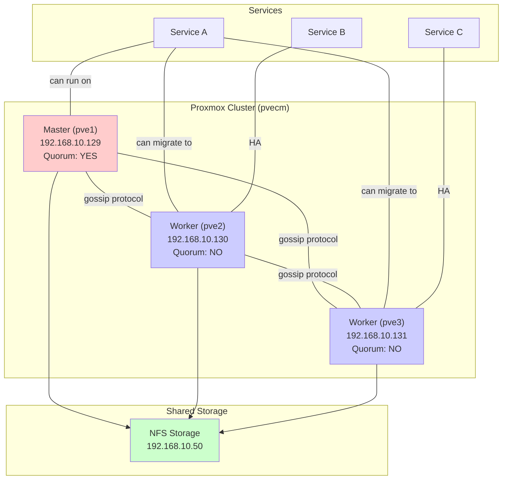
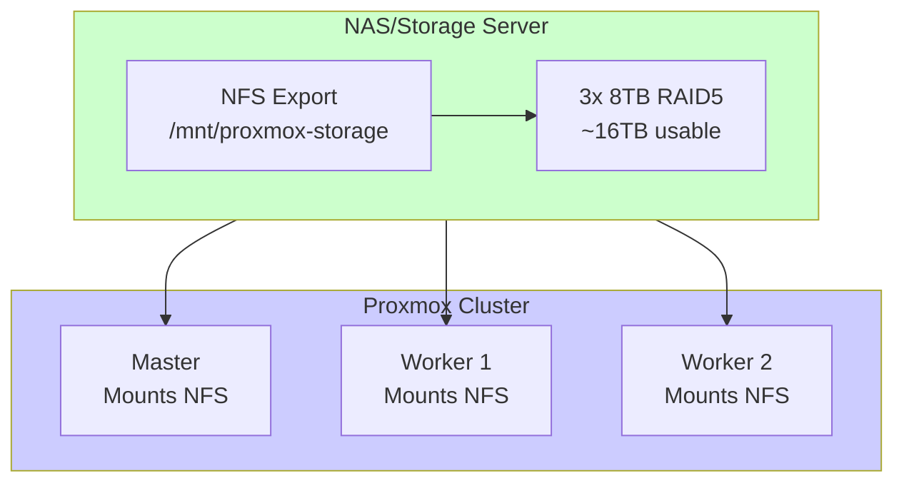

# Proxmox VE: Hypervisor Setup and Cluster Configuration

## What is Proxmox VE and Why Use It?

### Proxmox VE Definition

**Proxmox Virtual Environment (Proxmox VE)** is an open-source hypervisor platform that allows you to run and manage virtual machines and containers on dedicated hardware.

Think of it as the operating system for your cluster infrastructure. Instead of a single OS (like Ubuntu), you install Proxmox on bare metal, and then Proxmox manages virtual machines and containers running on that hardware.

### Key Capabilities

**What Proxmox Does:**
1. **Runs virtual machines** - Full operating systems (Windows, Linux, etc.)
2. **Runs containers** - Lightweight, application-focused (LXC, Docker)
3. **Manages resources** - CPU, RAM, storage allocation
4. **Provides clustering** - Multiple nodes work together
5. **High availability** - Services survive node failures
6. **Live migration** - Move VMs between nodes without downtime
7. **Web UI management** - Intuitive dashboard (no command line required)
8. **API access** - Automation via API calls

### What Makes Proxmox Ideal for Homelab

**Cost:**
- Free and open-source
- No licensing per VM/container
- No per-core charges
- Community edition includes all features

**Scalability:**
- Start with 1 node, grow to many
- Add nodes to cluster without downtime
- Scales from 1 to 100+ nodes

**Learning Value:**
- Learn enterprise hypervisor concepts
- Exactly what professionals use
- Skills transfer to career environments
- Real clustering and HA knowledge

**Community:**
- Large, active community
- Extensive documentation
- Forum support
- Regular updates

**Professional Features:**
- Proxmox Backup Server integration
- Advanced networking
- High availability and clustering
- Professional storage backends

**Flexibility:**
- Run any Linux distribution
- Windows VMs if needed
- Docker containers via LXC
- Full control over hardware

## Proxmox vs Alternatives

### Comparison Matrix

| Feature | Proxmox | ESXi | Hyper-V | XCP-ng | KVM |
|---------|---------|------|---------|--------|-----|
| **Cost** | Free | Free (limited) | Free (limited) | Free | Free |
| **Ease of use** | Good | Excellent | Good | Good | Difficult |
| **Web UI** | Yes | Yes | Yes (remote) | Yes | No |
| **Clustering** | Excellent | Excellent | Good | Good | Manual |
| **Community** | Large | Large | Medium | Growing | Fragmented |
| **Learning value** | High | High | Medium | High | Very High |
| **HA support** | Yes | Yes | Yes | Yes | Manual |
| **Live migration** | Yes | Yes | Yes | Yes | Yes |
| **LXC Containers** | **Yes** | No | No | No | No |
| **Scalability** | To 100+ nodes | Enterprise | Enterprise | Moderate | Custom |
| **Backup integration** | PBS (excellent) | Veeam | System Center | Manual | Manual |

### Detailed Comparison

#### ESXi (VMware)
**Pros:**
- Industry standard hypervisor
- Excellent professional support
- vSphere ecosystem very mature
- Excellent performance

**Cons:**
- Free version limited (no HA/clustering)
- Professional version expensive
- Proprietary, limited learning on open stack
- Less container-friendly

**Best for:** Enterprise environments with VMware investment

#### Hyper-V (Microsoft)
**Pros:**
- Excellent Windows integration
- Free with certain Windows licenses
- Professional support available
- Windows admin friendly

**Cons:**
- Free version limited
- Less intuitive web UI
- Licensing complexity
- Linux support not first-class

**Best for:** Windows-centric organizations

#### XCP-ng (Citrix/Open Source)
**Pros:**
- Open-source XenServer
- Good clustering
- Professional features free
- Growing community

**Cons:**
- Smaller community than Proxmox
- Fewer integrations
- LXC containers not first-class
- Less documentation

**Best for:** Users wanting Xen hypervisor specifically

#### KVM (Linux kernel built-in)
**Pros:**
- Extremely powerful if you know Linux
- No separate hypervisor layer
- Most flexible
- Very low overhead

**Cons:**
- Very steep learning curve
- Requires Linux expertise
- Manual everything (clustering, HA, management)
- Time investment very high

**Best for:** Linux experts wanting complete control

### Why Proxmox for This Workshop

**We chose Proxmox because:**
1. **Free with full features** - No licensing limitations
2. **Easy to learn** - Good UI, not overwhelming
3. **Industry relevant** - Real hypervisor used professionally
4. **Excellent clustering** - Perfect for teaching HA concepts
5. **Container support** - Can run both VMs and containers
6. **Community support** - Excellent documentation and forums
7. **Automation ready** - API and Terraform support
8. **Balance** - Not too simple (no learning), not too complex (overwhelming)

## Proxmox Installation Walkthrough

### Step 1: Download Proxmox ISO

**What to download:**
- Proxmox VE 8.x ISO (latest stable)
- Located at: proxmox.com/downloads

**File:** proxmox-ve_8.1-2_amd64.iso (approximately 2GB)

**Why this version:**
- Debian 12 base (stable, long-term support)
- ZFS filesystem support
- Latest features and security updates
- Supported for 5+ years

### Step 2: Create Bootable USB

**On macOS/Linux:**
```bash
# Insert USB drive and find its device name
diskutil list

# Unmount (replace diskX with your USB disk)
diskutil unmountDisk /dev/diskX

# Write ISO to USB
sudo dd if=~/Downloads/proxmox-ve_8.1-2_amd64.iso of=/dev/rdiskX bs=1m

# Eject
diskutil eject /dev/diskX
```

**On Windows:**
- Download Etcher (balena.io/etcher)
- Select ISO file
- Select USB drive
- Click Flash

### Step 3: Boot from USB

**For Lenovo ThinkCentre M920q:**
1. Insert USB drive
2. Power on machine
3. Press F12 during startup (or F2 for BIOS)
4. Select USB drive as boot device
5. Press Enter

**For Dell OptiPlex 3060:**
1. Insert USB drive
2. Power on machine
3. Press F12 or F10 during startup
4. Select USB drive
5. Press Enter

### Step 4: Proxmox Installation Wizard

The ISO boots into installer wizard:

**Step 4a: License Agreement**
- Read and accept the license
- Click "I agree"

**Step 4b: Location and Time**
```
Country: United States (or your location)
Time zone: America/Chicago (or your timezone)
Keyboard layout: English (US)
```

**Step 4c: Network Configuration**
```
Hostname: pve1 (for master), pve2 (for worker 1), pve3 (for worker 2)
Domain: localdomain (or your domain, e.g., homelab.local)

Network configuration:
  - Select primary NIC (usually eth0)
  - IP address: (we'll set static IPs after install)
  - Netmask: 255.255.255.0
  - Gateway: 192.168.10.1
  - DNS: 8.8.8.8 (for now, will use AdGuard later)
```

**Step 4d: Password and Email**
```
Root password: [Strong 20+ character password]
Email: admin@example.com (for notifications)
```

**Step 4e: Storage Configuration**
```
Disk: Select the NVMe SSD (usually nvme0n1)
Filesystem: ZFS (for redundancy)
ZFS Raid Level: 1 (for single node) or stripe (we'll configure)

Note: ZFS is excellent for reliability
      Single node: no RAID needed
      On this setup: local storage, no RAID
```

**Step 4f: Summary and Confirm**
- Review settings
- Click "Install"
- Wait for installation (2-5 minutes typically)

### Step 5: First Boot and Initial Configuration

After installation completes:

```
Installation finished successfully!
[restart]
```

Press any key to reboot. Machine will restart and boot into Proxmox.

**First boot takes 1-2 minutes as services start.**

**You'll see:**
- Proxmox splash screen
- Login prompt (Don't login here)
- System initializing

### Step 6: Access Web UI

Once Proxmox boots:

```
Open web browser and navigate to:
https://192.168.10.129:8006  (for master node)

You'll see HTTPS certificate warning (expected):
- Click "Advanced"
- Click "Proceed to site"
- Accept security risk
```

**Login:**
```
Username: root
Password: [password from installer]
```

You're now in the Proxmox Web UI!

## Initial Configuration and Setup

### Task 1: Disable Enterprise Repository

Proxmox defaults to "enterprise repository" which requires a paid subscription. We'll disable it and use community repos.

**In Proxmox Web UI:**
1. Navigate: **Node → master node name → Updates → Repositories**
2. You should see:
   - pve-enterprise (enabled, with lock icon)
   - This requires subscription
3. Click the **pve-enterprise** repository
4. Click **Disable**

### Task 2: Add No-Subscription Repository

**In Web UI:**
1. Navigate: **Node → Update repositories**
2. Click **Add**
3. Repository template: **Proxmox VE 8 (no-subscription)**
4. Click **Add**

Now Proxmox can fetch free updates without subscription.

### Task 3: Remove EULA Nag Screen

Proxmox shows license agreement on login (non-functional in free version). Remove it:

**Via SSH (terminal):**
```bash
# SSH into master node
ssh root@192.168.10.129

# Edit the environment file
nano /etc/environment

# Add at end of file:
LANG=en_US.UTF-8
LANGUAGE=en_US:en

# Exit SSH
exit
```

**Or via Web UI:**
1. Click user icon (top right)
2. Click "Settings"
3. Language: "English"
4. Locale: "en_US"

### Task 4: Configure Static IP Addresses

Although we set IP during installation, confirm and refine:

**Master Node:**
```bash
SSH into master: ssh root@192.168.10.129

Edit network config:
nano /etc/network/interfaces

Set:
auto lo
iface lo inet loopback

auto ens1
iface ens1 inet static
    address 192.168.10.129/24
    gateway 192.168.10.1
    dns-nameservers 8.8.8.8 8.8.4.4

# Reload networking
systemctl restart networking
```

**Repeat for workers (IPs .130 and .131)**

## Creating a 3-Node Proxmox Cluster

### Cluster Architecture

A Proxmox cluster allows 3 nodes to work together:



### Cluster Concepts

**Quorum:**
- Voting system determining cluster validity
- 3-node cluster: 2/3 votes required
- Prevents split-brain (nodes thinking other nodes are dead)
- Master has 1 vote, workers have 1 vote each

**Gossip Protocol:**
- Nodes constantly communicate with each other
- Exchange state information
- Detect node failures
- Automatic failover

**Cluster Voting:**
- If master fails: Workers elect new quorum leader
- If 1 worker fails: Cluster continues (2/3 quorum)
- If 2 nodes fail: Cluster stops (1/3 quorum insufficient)

### Step-by-Step: Create Cluster

#### On Master Node (pve1 - 192.168.10.129):

**Step 1: Create cluster**

```bash
# SSH into master
ssh root@192.168.10.129

# Create cluster
pvecm create proxmox-cluster

# Output:
# Cluster created with cluster name 'proxmox-cluster'
# Node 'pve1' created as cluster master
```

**Step 2: Get cluster join key**

```bash
# Display cluster info
pvecm status

# Should show:
# Cluster information
# ====================
# Name:      proxmox-cluster
# Config Version:    1
# Cluster Leader:    pve1
# Nodes:     1
#  - pve1 (V: 0, F: 0, E: 0, S: 0)
```

**Step 3: Get join token**

```bash
# Generate cluster join key
pvecm nodes

# To add new nodes, we need the fingerprint
# This is shown in /etc/pve/pve-root-ca.pem

# Display fingerprint
openssl x509 -in /etc/pve/nodes/pve1/pve-ssl.pem -noout -fingerprint
# Fingerprint=AB:CD:EF:12:34:56:78:90...
```

#### On Worker Node 1 (pve2 - 192.168.10.130):

**Step 1: Join cluster**

```bash
# SSH into worker 1
ssh root@192.168.10.130

# Join cluster
pvecm add 192.168.10.129 -ring_heartbeat=0
# You'll be prompted to confirm fingerprint
# Enter: AB:CD:EF:12:34:56:78:90... (from master)

# Press YES to accept

# Cluster will synchronize and node will join
```

**Step 2: Verify join**

```bash
# On worker, check cluster status
pvecm status

# Should show:
# Name:      proxmox-cluster
# Nodes:     2
#  - pve1 (V: 1, F: 1, E: 2, S: 2)
#  - pve2 (V: 1, F: 1, E: 2, S: 2)
```

#### On Worker Node 2 (pve3 - 192.168.10.131):

**Repeat steps from Worker Node 1, but for pve3**

```bash
ssh root@192.168.10.131
pvecm add 192.168.10.129 -ring_heartbeat=0
# Confirm fingerprint again
# Wait for synchronization
```

### Verify Full Cluster

Once all 3 nodes joined, verify from any node:

```bash
# Run on master
ssh root@192.168.10.129
pvecm status

# Output should show:
# Cluster information
# ====================
# Name:      proxmox-cluster
# Config Version:    3
# Cluster Leader:    pve1
# Nodes:     3
#  - pve1 (V: 1, F: 1, E: 3, S: 3)
#  - pve2 (V: 1, F: 1, E: 3, S: 3)
#  - pve3 (V: 1, F: 1, E: 3, S: 3)
```

### Cluster Verification Checklist

After cluster creation, verify:

**In Web UI:**
1. Go to **Datacenter → Cluster**
2. All 3 nodes should show "ONLINE"
3. Status shows quorum status (should be OK)

**Via command line:**
```bash
# Check corosync status
systemctl status corosync

# Check pve cluster service
systemctl status pve-cluster

# Check cluster members
pvecm nodes

# Check quorum
pvecm status
```

**Expected output:**
- 3 nodes listed
- All nodes "online"
- Quorum: "OK"
- Leader elected

## Shared Storage Configuration (NFS)

### Storage Overview

Proxmox cluster nodes can store VMs/containers in:

**Local storage** (what we have now):
- Each node has own NVMe SSD
- ~200GB usable per node (after OS)
- Sufficient for initial learning
- No live migration between nodes

**Shared storage** (future - Phase 2):
- All nodes access same storage
- Live migration works (move VM between nodes without downtime)
- Single point of failure (if storage dies, all VMs affected)
- Requires backup strategy

For Phase 1, local storage is fine. Phase 2 adds NFS.

### NFS Storage Architecture



### Future NFS Setup (Not in Phase 1)

When you add TerraMaster NAS in Phase 2:

**On NAS (TerraMaster):**
```bash
# Create export directory
mkdir -p /mnt/proxmox-storage

# Export via NFS
# In NAS admin:
# Share → NFS Share
# Path: /mnt/proxmox-storage
# Hosts: 192.168.10.129, 192.168.10.130, 192.168.10.131
# Permissions: read/write
```

**On each Proxmox node:**
```bash
# Create mount point
mkdir -p /mnt/pve/proxmox-nfs

# Mount NFS
mount -t nfs 192.168.10.50:/mnt/proxmox-storage /mnt/pve/proxmox-nfs

# Make persistent (in /etc/fstab):
192.168.10.50:/mnt/proxmox-storage /mnt/pve/proxmox-nfs nfs defaults 0 0

# Reload
systemctl daemon-reload
mount -a
```

**In Proxmox Web UI:**
```
Datacenter → Storage → Add NFS
  Content: Images, Rootdir, Backups
  Export: 192.168.10.50:/mnt/proxmox-storage
  Path: /mnt/pve/proxmox-nfs
```

Now all nodes can use same storage and perform live migrations!

## Proxmox Web UI Overview

### Main Dashboard

After login, you see the **Dashboard**:

```
┌─────────────────────────────────────────┐
│ PROXMOX VE                        [user]│
├─────────────────────────────────────────┤
│ Left Sidebar:                           │
│  ┌─ Datacenter                          │
│  │  ├─ Cluster                          │
│  │  ├─ Nodes                            │
│  │  ├─ Storage                          │
│  │  └─ Firewall                         │
│  ├─ pve1 (Master)                       │
│  │  ├─ System                           │
│  │  ├─ Updates                          │
│  │  ├─ Disks                            │
│  │  ├─ Network                          │
│  │  └─ Virtual Machines                 │
│  ├─ pve2 (Worker 1)                     │
│  ├─ pve3 (Worker 2)                     │
│  └─ [Create VM] [Create Container]      │
│                                          │
│ Main Panel: Shows cluster status,       │
│ resource usage, recent tasks            │
└─────────────────────────────────────────┘
```

### Key Navigation

**Datacenter Level:**
- **Cluster:** View all nodes, quorum status
- **Nodes:** Manage individual nodes
- **Storage:** Add/remove storage pools
- **Firewall:** Network security rules
- **Users/Permissions:** Access control

**Node Level (click on pve1, pve2, pve3):**
- **System:** Node status, kernel, services
- **Updates:** Check for updates
- **Disks:** Storage usage and management
- **Network:** NIC configuration, bridges
- **Containers:** LXC containers on this node
- **Virtual Machines:** VMs on this node
- **Backups:** VM/container backups

**Create Resources:**
- **Create VM:** Launch VM creation wizard
- **Create LXC:** Create lightweight container

### Common Tasks in Web UI

**Create a Virtual Machine:**
1. Right-click on node → **Create VM**
2. Choose resource
3. Select OS
4. Allocate CPU/RAM
5. Allocate disk
6. Configure network
7. Create

**Create a Container:**
1. Right-click on node → **Create LXC**
2. Choose template (Ubuntu, Debian, etc.)
3. Configure resources
4. Configure network
5. Create

**View Resource Usage:**
1. Click on any node
2. Go to **Summary** tab
3. See CPU, RAM, storage usage
4. View running tasks

## LXC Containers vs VMs: When to Use Which

### Virtual Machines (VMs)

**What is a VM?**
A complete operating system running as a guest on the hypervisor. Like running a full computer inside your computer.

```
Your Computer Hardware
  └─ Proxmox Hypervisor
      ├─ VM 1: Ubuntu 20.04
      │  ├─ Kernel
      │  ├─ Services
      │  └─ Applications
      └─ VM 2: Windows 10
         ├─ Kernel
         ├─ Services
         └─ Applications
```

**When to use VMs:**
- Running Windows
- Running different kernels
- Maximum isolation (security)
- Snapshot/restore entire OS
- Need full OS capabilities
- Testing different distributions

**Pros:**
- Complete isolation
- Can run any OS
- Full kernel control
- Great for testing

**Cons:**
- Higher resource overhead
- Slower boot time
- More CPU/RAM needed
- More storage per instance

### LXC Containers

**What is a container?**
A lightweight isolated environment sharing the same Linux kernel as host. Like a sandboxed application rather than full OS.

```
Your Computer Hardware
  └─ Proxmox Hypervisor (kernel)
      ├─ Container 1: Ubuntu environment
      │  ├─ Filesystem
      │  ├─ Services
      │  └─ Applications
      └─ Container 2: Debian environment
         ├─ Filesystem
         ├─ Services
         └─ Applications

(Both share same kernel, isolated everything else)
```

**When to use containers:**
- Running Linux services
- Want lightweight and fast
- Multiple similar instances
- Docker deployment
- Resource-constrained
- Most of your services

**Pros:**
- Very lightweight
- Fast boot (seconds)
- Minimal resource overhead
- Run 50+ easily
- Great for microservices

**Cons:**
- Only Linux
- Shared kernel (less isolation)
- Can't run different kernel versions

### Decision Matrix

| Need | VM | Container |
|------|----|-----------|
| Run Windows | **VM** | No |
| Run Windows apps | **VM** | No |
| Run Linux service | Both OK | **Container** |
| Multiple services | Both OK | **Container** |
| Maximum isolation | **VM** | No |
| Resource efficiency | Container | **Container** |
| Fast deployment | Container | **Container** |
| Learning Linux | **VM** | OK |
| Production services | Both OK | **Container** |
| Database (single) | **VM** | **Container** |
| Kubernetes nodes | **VM** | **Container** |

### Recommendation for Homelab

**Start with containers:**
- Most services are Linux-based
- Docker Compose runs in containers
- Minimal resource overhead
- Can run 50+ easily
- Fastest to deploy

**Use VMs for:**
- Testing different OS
- Windows-specific work
- Complete isolation needs
- Learning hypervisor concepts

**Our approach:**
- 2-3 VMs on master for infrastructure
- 50-100 LXC containers for services
- Mix and match as needed

## Creating API Tokens for Terraform

### Why API Tokens?

Terraform needs authentication to create/manage resources in Proxmox. Instead of using root password, we create limited-access API tokens.

**Security principle:** Use least privilege
- Token only has permissions needed
- If token compromised, limited damage
- Can revoke token without password change

### Creating API Token (Web UI)

**Step 1: Create User (if needed)**

```
Datacenter → Users → Create User

Name: terraform
Realm: Linux PAM
Comment: Terraform automation account
```

**Step 2: Create Token**

```
Datacenter → API Tokens → Add

User: terraform
Token ID: terraform-token
Expire: Never (or set expiry date)
Click: Add
```

**Step 3: Store Token Securely**

You'll see token displayed once. Save it:
```
token_id: terraform@pam!terraform-token
token_secret: xxxxxxxx-xxxx-xxxx-xxxx-xxxxxxxxxxxx
```

**Never share this token!**

### Creating API Token (Command Line)

```bash
# SSH into master
ssh root@192.168.10.129

# Create user
pveum useradd terraform@pam

# Create token
pveum aclmod / -user terraform@pam -role PVEAdmin

# List tokens
pveum token list

# Create specific token
pveum token add terraform@pam terraform-token
```

### Setting Token Permissions (for security)

For production, restrict permissions:

```bash
# Give only VM/Container management
pveum aclmod /vms -user terraform@pam -role PVEVMUser
pveum aclmod /storage -user terraform@pam -role PVEStorageUser

# Not full admin
```

### Using Token in Terraform

In Terraform code:

```hcl
terraform {
  required_providers {
    proxmox = {
      source = "telmate/proxmox"
      version = "~> 2.9.0"
    }
  }
}

provider "proxmox" {
  pm_api_url      = "https://192.168.10.129:8006/api2/json"
  pm_api_token_id = "terraform@pam!terraform-token"
  pm_api_token_secret = "xxxxxxxx-xxxx-xxxx-xxxx-xxxxxxxxxxxx"
  pm_tls_insecure = true  # for self-signed cert
}

resource "proxmox_vm_qemu" "example" {
  name        = "example-vm"
  vmid        = 100
  clone       = "ubuntu-20-template"
  cores       = 2
  memory      = 2048
  # ... more config
}
```

### Token Best Practices

**Security:**
- Store token in `.tfvars` file (gitignore it!)
- Or use environment variables: `PROXMOX_VE_API_TOKEN_ID`
- Never commit token to git
- Rotate tokens periodically
- Review token access logs

**Token Creation Checklist:**
- [ ] Token created with minimal permissions
- [ ] Token stored securely (not in git)
- [ ] Terraform can authenticate
- [ ] Test token with simple resource creation
- [ ] Document token location and access

## Proxmox Checklist: Post-Installation

After completing this section, verify:

**Infrastructure:**
- [ ] All 3 nodes installed with Proxmox
- [ ] Cluster created (3 nodes)
- [ ] Cluster shows quorum OK
- [ ] All nodes online in Web UI
- [ ] Static IPs configured (.129, .130, .131)

**Configuration:**
- [ ] Enterprise repo disabled
- [ ] No-subscription repo added
- [ ] EULA nag removed
- [ ] Network configured correctly
- [ ] DNS set to 8.8.8.8 (temporary)

**Access:**
- [ ] Can login to Web UI
- [ ] Can SSH to each node
- [ ] Web UI shows all 3 nodes in cluster
- [ ] Firewall allows access from your VLAN 30

**API Access:**
- [ ] API token created for Terraform
- [ ] Token stored securely
- [ ] Token tested with simple API call

## Next Steps

You've completed Session 1 Theory covering:
1. What is a homelab and why build one
2. Getting started with budgets and approach
3. Specific hardware selection
4. Network infrastructure design
5. Proxmox hypervisor setup

In Session 2 (Practical), you'll:
- Physically assemble hardware
- Install Proxmox on each node
- Create the cluster
- Configure networking
- Deploy first services

Then in Session 3-4, you'll deploy actual services:
- Docker and containers
- Kubernetes (optional)
- Monitoring and observability
- Backups and disaster recovery

**You now have the knowledge foundation to build a professional homelab!**
