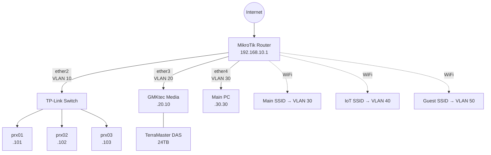
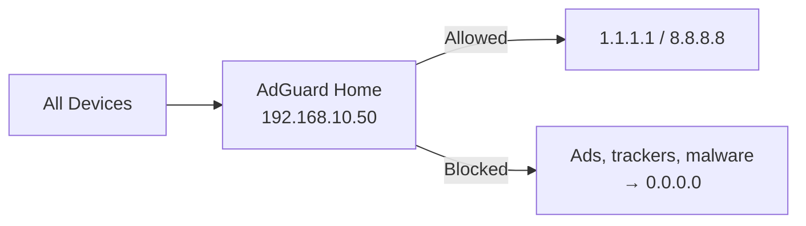
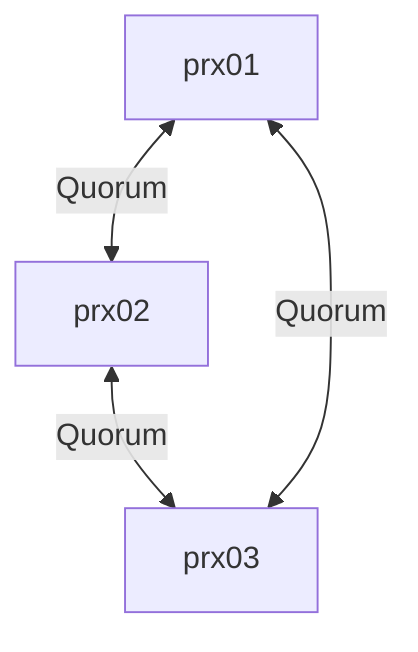

<!-- _class: lead invert -->
<!-- _backgroundColor: #1a1a2e -->

# Homelab Workshop

## Session 1: Theory & Foundation

Build production-like infrastructure from the ground up

<!-- Today we'll cover the theory behind building a homelab - what it is, the hardware, networking, and virtualization. This sets the stage for the hands-on session. -->

---

# Agenda

| Time | Topic |
|------|-------|
| 10 min | **What is a Homelab?** Why build one, use cases |
| 10 min | **Hardware Selection** Mini PCs, specs, budget |
| 15 min | **Network Design** VLANs, IP scheme, security |
| 15 min | **Proxmox** Installation, clustering, LXC vs VMs |
| 5 min | **Q&A** |

**Total: ~55 minutes**

<!-- Quick overview of what we'll cover. Theory first, hands-on in Session 2. -->

---

<!-- _class: lead invert -->
<!-- _backgroundColor: #16213e -->

# What is a Homelab?

*~10 minutes*

---

# What is a Homelab?

A **personal computing environment** where you build, configure, and manage your own IT infrastructure at home.

- **Your own servers** - physical hardware you control
- **Your own network** - VLANs, firewalls, DNS
- **Your own services** - apps running 24/7
- **Your own data** - complete privacy and ownership

> Think of it as a miniature data center in your home

<!-- A homelab is NOT just a gaming PC or NAS. It's a complete ecosystem - servers, networking, and services - that mimics what you'd find in a real data center, just smaller and in your home. -->

---

# Why Build a Homelab?

**Learning & Career**
- Hands-on practice with enterprise technologies
- Build a portfolio for interviews — DevOps skills are in demand

**Self-Hosting & Privacy**
- Run your own cloud storage, password manager, media server
- Your data stays under your roof — no subscriptions needed

**It's Fun**
- Tinker, break things, learn, repeat

<!-- The blend of learning + practical value is what makes homelabs special. You're not just studying - you're building real infrastructure that you actually use daily. -->

---

# What Can You Run?

| Category | Services |
|----------|----------|
| **DNS & Security** | AdGuard Home, Pi-hole, WireGuard |
| **Media** | Plex, Jellyfin, Immich (photos) |
| **Productivity** | Nextcloud, Vaultwarden, Gitea |
| **Smart Home** | Home Assistant, Zigbee2MQTT |
| **Monitoring** | Grafana, Prometheus, Uptime Kuma |
| **Development** | CI/CD runners, staging environments |
| **Networking** | Reverse proxy, Cloudflare Tunnel, VPN |

<!-- This is just a sample. The self-hosted ecosystem is massive. r/selfhosted has 500k+ members sharing what they run. -->

---

<!-- _class: lead invert -->
<!-- _backgroundColor: #16213e -->

# Hardware Selection

*~10 minutes*

---

# Why Mini PCs?

| | Enterprise Server | Mini PC | Raspberry Pi |
|---|---|---|---|
| **Power** | 250-400W idle | **35-65W** | 5-15W |
| **Noise** | 60+ dB (loud) | **<30 dB (silent)** | Silent |
| **Cost** | $200-800 used | **$250-400 used** | $75-100 new |
| **CPU** | Xeon (old gen) | **i5/i7 8th gen** | ARM (limited) |
| **RAM** | 64-128GB | **16-32GB** | 4-8GB |
| **VMs?** | Yes | **Yes** | No (ARM) |

**Mini PCs hit the sweet spot** - powerful enough for real workloads, efficient enough to run 24/7, quiet enough for your home.

<!-- Enterprise servers are overkill for learning. RPi is too limited for VMs. Mini PCs from corporate refresh cycles are perfect - they were built to run all day in offices. -->

---

<!-- _class: small-text -->

# Our Workshop Hardware

### Master Node - Lenovo ThinkCentre M920q
- Intel Core **i7-8700T** (6 cores / 12 threads)
- **32GB** DDR4 RAM - 512GB NVMe SSD
- ~65W typical - **~$400 used**

### Worker Nodes (x2) - Dell OptiPlex 3060 Micro
- Intel Core **i5-8500T** (4 cores / 8 threads)
- **16GB** DDR4 RAM - 256GB NVMe SSD
- ~35W typical - **~$250 each used**

### Cluster Total
**14 cores | 28 threads | 64GB RAM | 1TB SSD | ~135W | ~$900**

<!-- The M920q as master has extra RAM for control planes. The OptiPlex workers are identical for predictable performance. All 8th gen Intel for consistent behavior. -->

---

# Power & Cost

| State | Power Draw | Monthly Cost* |
|-------|-----------|--------------|
| Idle (all 3 nodes) | 45W | ~$5 |
| **Typical load** | **135W** | **~$15** |
| Heavy load | 220W | ~$25 |
| Max stress | 280W | ~$32 |

*At $0.12/kWh*

**Comparison:**
- Gaming PC running 24/7: **$35/month**
- Enterprise Dell R720: **$30/month**
- Our mini PC cluster: **$15/month**

<!-- Power efficiency is the #1 reason to use mini PCs. The electricity savings pay for the hardware difference vs enterprise servers in about 3 years. -->

---

<!-- _class: lead invert -->
<!-- _backgroundColor: #16213e -->

# Network & Infrastructure Design

*~15 minutes*

---

# What are VLANs?

**Virtual LANs** = isolated network segments on the same physical hardware

Without VLANs (flat network):
```
All devices → same network → everything can talk to everything
                             (security nightmare)
```

With VLANs:
```
IoT devices    → VLAN 40 → internet only (isolated)
Guest WiFi     → VLAN 50 → internet only (isolated)
Your laptop    → VLAN 30 → can access servers
Proxmox nodes  → VLAN 10 → management only
```

**Why?** A hacked smart bulb can't reach your password manager.

<!-- VLANs enforce trust boundaries at the network level. This is how enterprises segment their networks. Learning this here is directly applicable to real jobs. -->

---

# Our 5-VLAN Design

| VLAN | Name | Network | Purpose | Access |
|------|------|---------|---------|--------|
| **10** | Management | 192.168.**10**.0/24 | Proxmox, infra | Full access to all |
| **20** | Servers | 192.168.**20**.0/24 | Media, storage | From Mgmt + Trusted |
| **30** | Trusted | 192.168.**30**.0/24 | PC, phones | Internet + Servers |
| **40** | IoT | 192.168.**40**.0/24 | Smart home | Internet only |
| **50** | Guest | 192.168.**50**.0/24 | Visitors | Internet only |

**Router:** MikroTik hAP ac3 (handles VLANs + firewall)
**Switch:** TP-Link LS108G (8-port gigabit, ~$25)

<!-- The key insight: Management VLAN can reach everything, IoT/Guest can only reach the internet. Trusted can access Servers but not Management. This is defense in depth. -->

---

# Network Topology



<!-- Each physical port on the router maps to a VLAN. WiFi SSIDs also map to VLANs. This means a guest on your WiFi is completely isolated from your servers. -->

---

# DNS & Ad Blocking



- **AdGuard Home** runs on Docker host LXC container
- All VLANs use AdGuard as DNS server via DHCP
- Network-wide ad blocking — **every device, no app needed**
- ~30% of DNS queries get blocked (ads, telemetry, trackers)

<!-- DNS-level blocking is the most effective ad blocking. It works on smart TVs, phones, IoT devices - everything. No browser extension needed. -->

---

<!-- _class: lead invert -->
<!-- _backgroundColor: #16213e -->

# Proxmox VE

*~15 minutes*

---

# What is Proxmox VE?

**Open-source virtualization platform** (free, based on Debian Linux)

- Run **VMs** (full virtual machines) and **LXC containers** (lightweight)
- Web-based management UI at `https://node-ip:8006`
- Built-in clustering, snapshots, backups
- Massive community and documentation

### Why Proxmox?

| | Proxmox | VMware ESXi | Hyper-V |
|---|---|---|---|
| **Cost** | Free | $$$ (free tier limited) | Windows license |
| **Linux support** | Excellent | Good | OK |
| **Community** | Huge | Enterprise | Enterprise |
| **Learning curve** | Moderate | Steep | Moderate |

<!-- Proxmox is the homelab standard. Free, powerful, great community. The web UI is intuitive - you can create VMs, manage storage, and monitor resources all from a browser. -->

---

# LXC Containers vs VMs

| | LXC Container | Virtual Machine |
|---|---|---|
| **Startup** | **2-5 seconds** | 30-60 seconds |
| **RAM overhead** | **~50MB** | 512MB-1GB |
| **Isolation** | Shared kernel | Full isolation |
| **Use case** | **Services, Docker** | Windows, untrusted code |
| **Performance** | Near-native | ~95% native |

### Rule of thumb:
- **Use LXC** for Linux services (Docker host, web servers, DNS)
- **Use VMs** for Windows, Kubernetes nodes, or untrusted workloads

We'll deploy a **Docker host as an LXC container** in Session 2.

<!-- LXC containers are the default choice for homelabs. They're fast, lightweight, and perfect for running Docker. Only use VMs when you need full isolation or a different OS. -->

---

# Proxmox Cluster Setup

### 3-Node Cluster = High Availability



**Setup steps:**
1. Install Proxmox on each node (USB boot, ~15 min each)
2. On prx01: `pvecm create homelab-cluster`
3. On prx02/03: `pvecm add 192.168.10.129`
4. Create **API token** for Terraform: Datacenter → Permissions → API Tokens

**API Token** bridges us to **Session 2** → Infrastructure as Code

<!-- 3 nodes is the minimum for quorum - the cluster survives if one node goes down. The API token we create here is what Terraform will use to provision containers automatically. -->

---

<!-- _class: lead invert -->
<!-- _backgroundColor: #16213e -->

# Q&A

*5 minutes*

---

# Questions?

### What we covered today:
- **Homelabs** — personal infrastructure for learning & self-hosting
- **Hardware** — mini PCs: efficient, quiet, affordable (~$900 total)
- **Network** — 5 VLANs for security segmentation
- **Proxmox** — free virtualization with clustering

### Coming up in Session 2 (Hands-on):
1. Deploy infrastructure with **Terraform**
2. Create LXC containers and VMs
3. Setup **Tailscale** VPN for remote access
4. Deploy services with **Docker Compose**

### Resources
`r/homelab` · `r/selfhosted` · `proxmox.com/docs` · `servethehome.com`

<!-- Open discussion. Address any concerns about hardware, budget, or complexity. The goal is that everyone feels confident going into the hands-on session. -->
